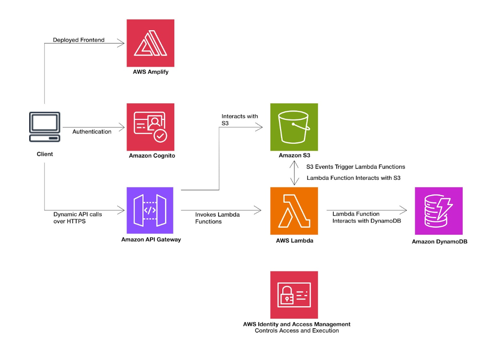
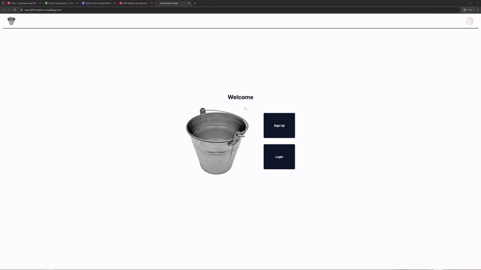
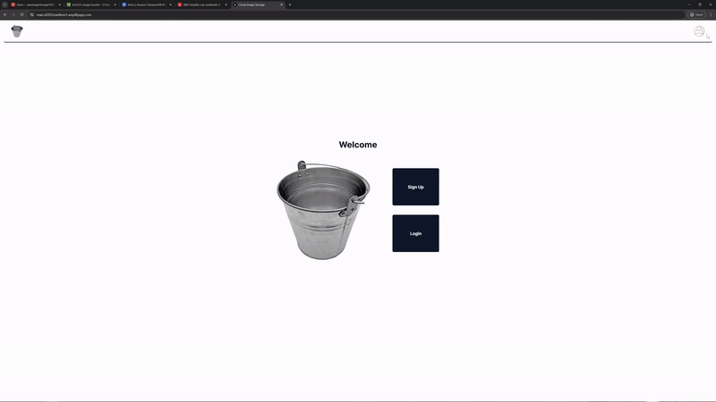
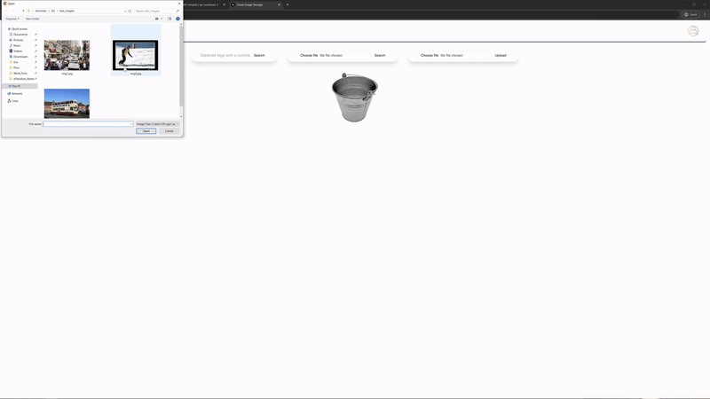
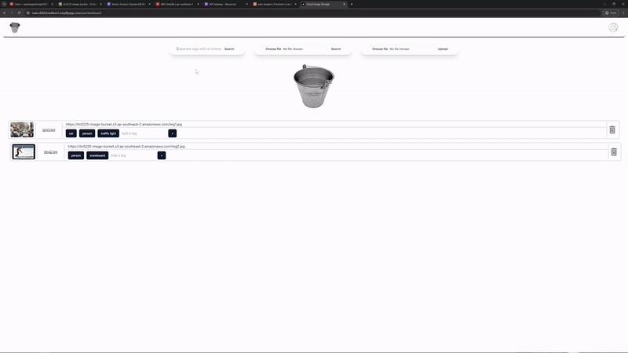
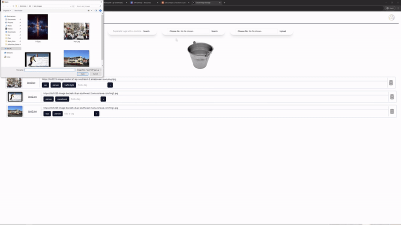
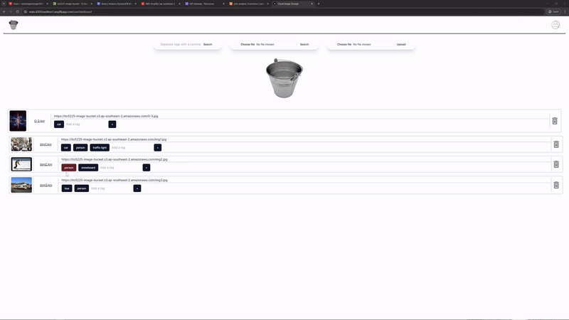
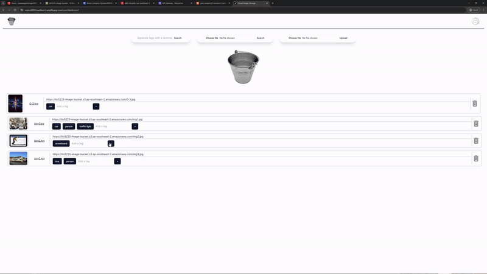
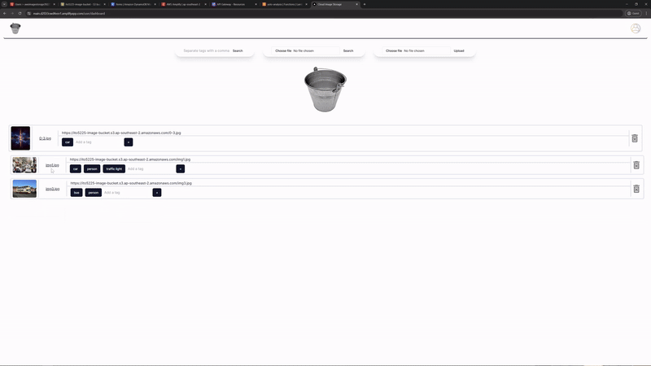

# AWS Image Storage NextJS

-   AWS Amplify
-   Amazon Cognito
-   Amazon API Gateway
-   Amazon S3
-   Amazon DynamoDB
-   AWS Lambda

##### _Register for a Cognito Account_

##### _Dashboard displays all the images inside the S3 Bucket_

##### _Delete images from S3_

##### _Upload images to S3_

##### _Search based on tags_

##### _Search based on tags from an image_

##### _Delete tags_

##### _Add tags_

##### _Access S3 bucket images through signed URLs_

